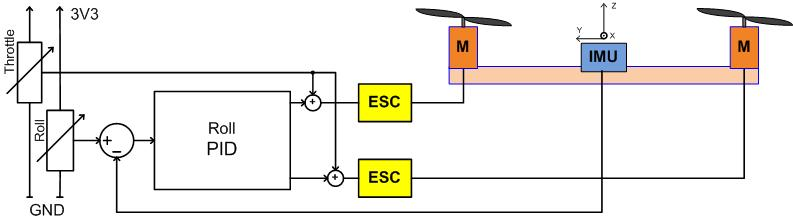
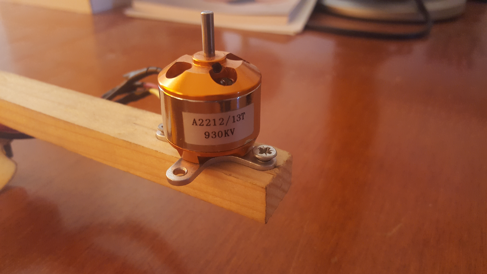
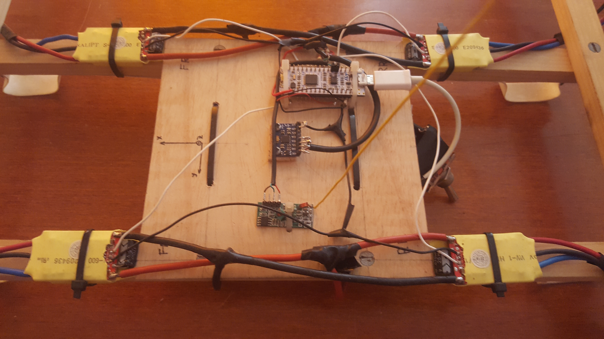
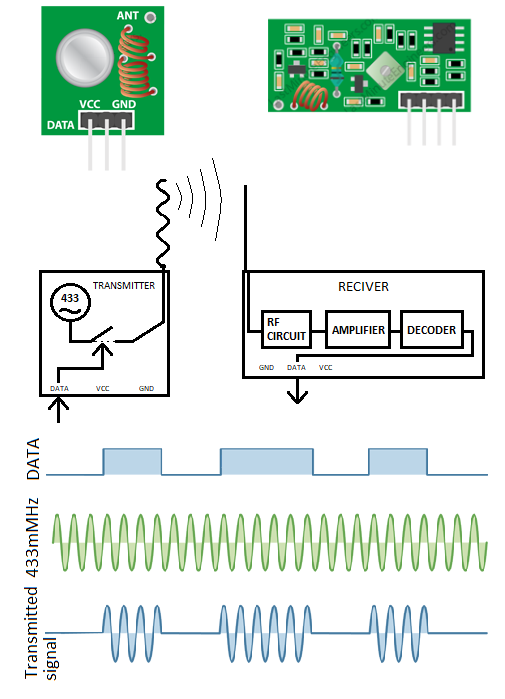
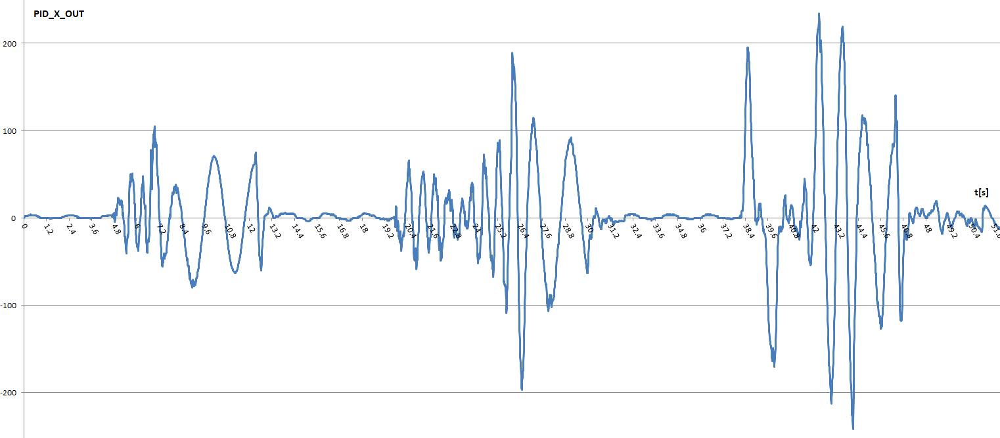
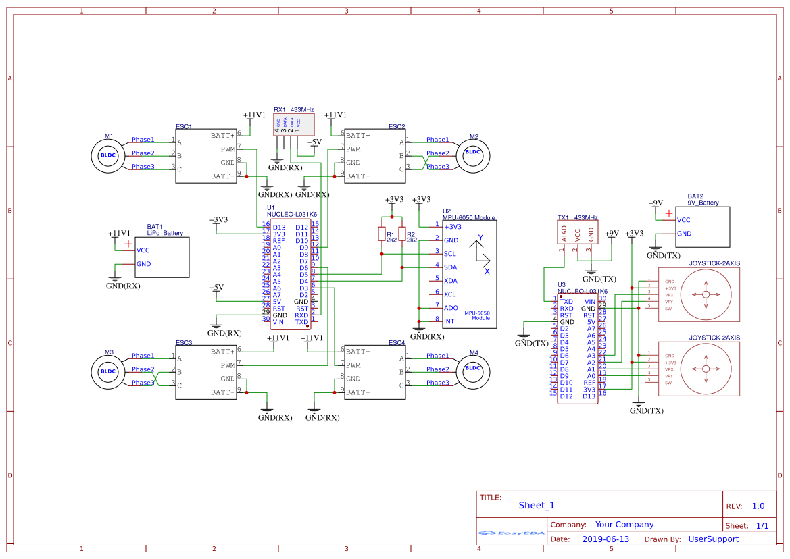
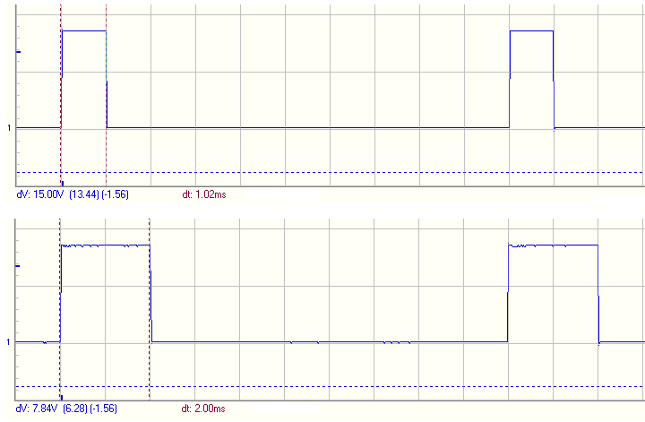
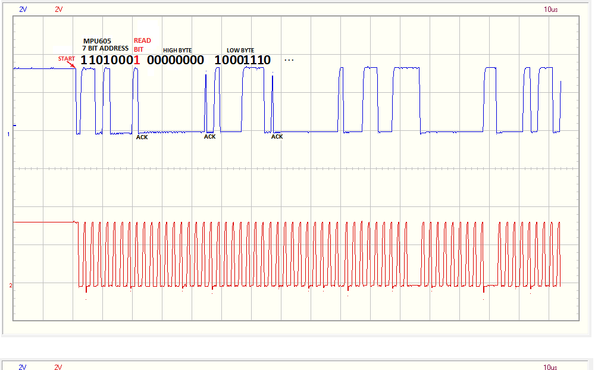
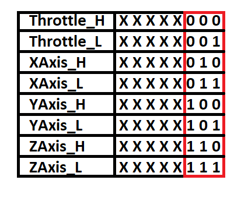
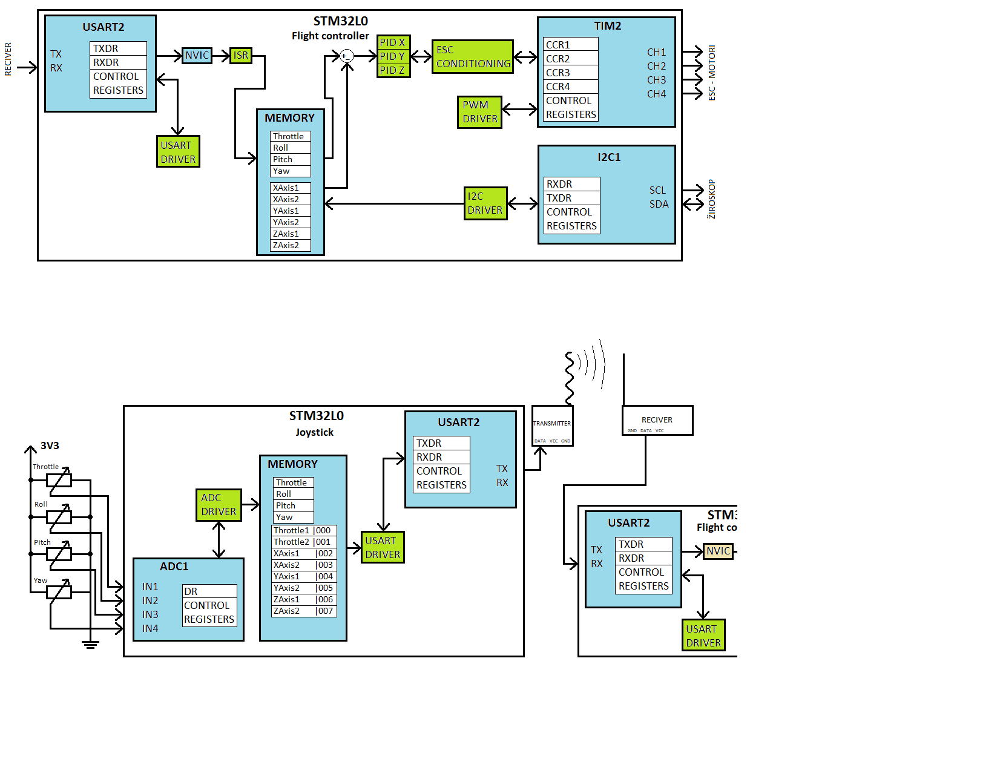

# Quadcopter flight controller software and construction
* Take a look at the project report [pdf](Programska_in_strojna_oprema_za_komunikacijo_in_vodenje_quadcoptera.pdf) and [videos](videos) of me testing the quadcopter.

## This picture shows the main conceptual angular speed control loop on the vehicle.
 Throttle and Roll potentiometers are shown only for ease of understanding, they are not normally installed on the vehicle, but on the remote control unit. The flight controller regulates the speed of rotation of the vehicle and not the absolute angle. This makes it harder to steer the vehicle because the driver needs to adjust the speed of the rotation of the vehicle and with that the angle of the vehicle. For example, the joystick potentiometers are in their neutral positions and the vehicle is flying horizontally to the ground. The driver wants to steer to the left with moderate speed. This means that the vehicle needs to be tilted slightly to the left to move itself to the left. The driver turns the roll joystick to the left and thus begins to increase the speed of rotation. When the driver sees that the vehicle is almost at the desired angle, he pulls the joystick back to neutral position, meaning the desired speed of rotation is zero. The vehicle is now at a certain angle and the driver is sending it commands to rotate at speed zero. The vehicle tries to keep the speed of rotation at zero, thus stays at that certain angle and moves to the left.

## Frame drawing and a photos of a prototype
 

## 930kv BLDC 150W

## MCU board, 4 cheap hobbysky ESCs, cheapest On-off keying receiver module and MPU6050 IMU module
 

## OOK Antenna modules. Transmitter and receiver
 

## Flight controller response
The vehicle is hanged on two farthest points on the x axis. The graph shows 3 different events. The first part represents the response of the vehicle after the motors were started (~10% throttle). The second and third parts are caused by pushing the vehicle.

## Schematic of the vehicle and the remote controller

## Signal for the ESCs
   

## I2C IMU module communication
        

## Transmission protocol
The remote controller samples all of the potentiometers and sends their values, with appended 3bit ordinal number, to the flight controller on the vehicle. If either one of the values is not received, the whole packet of 8 bytes is discarded and the vehicle is waiting for the byte with ordinal number zero and starts to receive new packet of 8 bytes. When whole packet is successfully received, the packet is saved to appropriate address in the memory and can now be used by the control algorithm.
        

## Program block diagram
        

