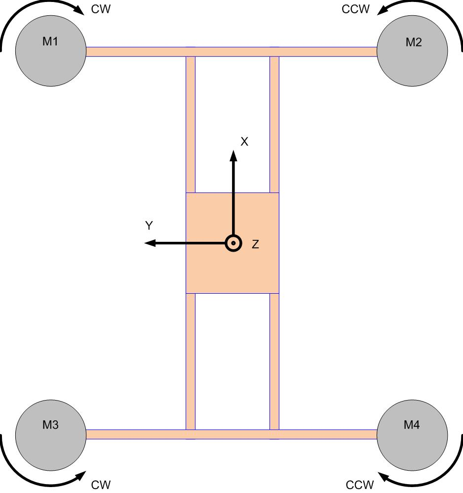
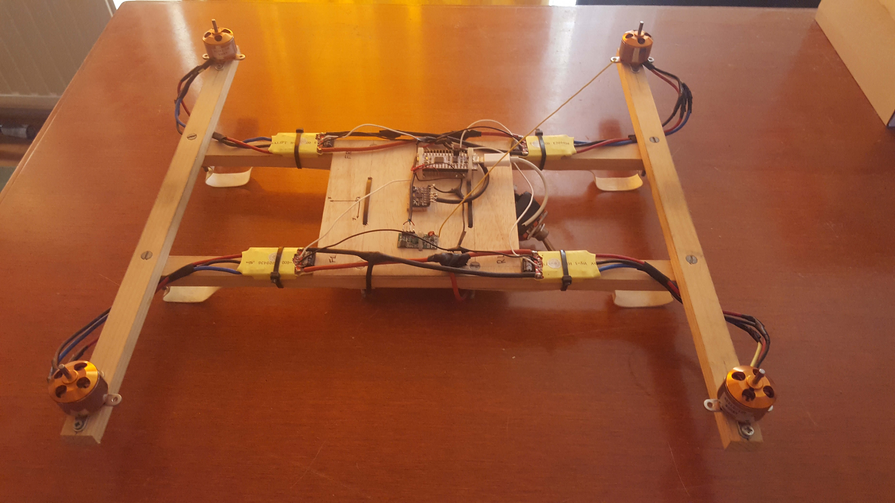
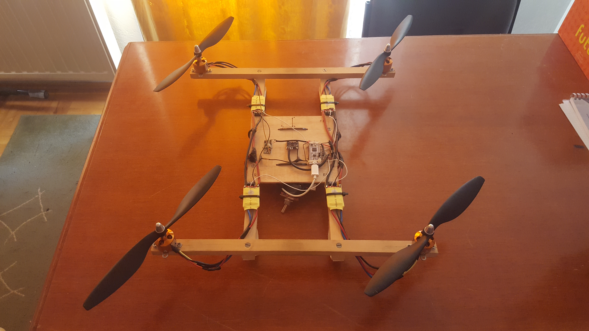

# Quadcopter flight controller software and construction
* Take a look at the project report [pdf](Programska_in_strojna_oprema_za_komunikacijo_in_vodenje_quadcoptera.pdf) and [videos](videos) of me testing the quadcopter.

 
 
       
       
        
        
        
        

